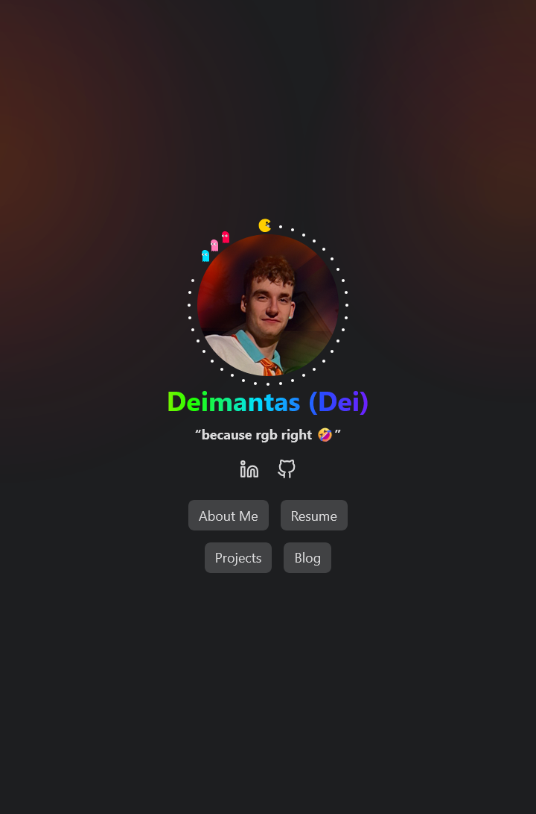

# My Personal Site — Hugo + PaperMod

<p align="center">
  
  <br/>
  <em>Live preview image used for social cards</em>
  <br/>
  <a href="https://deiserver.dev">deiserver.dev</a>

  <div align="center">
    <a href="https://deiserver.dev/blog/">Blog</a>
    ·
    <a href="https://deiserver.dev/experience/">Resume</a>
    ·
    <a href="https://deiserver.dev/projects/">Projects</a>
  </div>
</p>

## Stack

- Hugo (extended) with the PaperMod theme (as a submodule)
- Firebase Hosting + GitHub Actions CI/CD
  - PRs deploy to preview channels
  - main branch deploys live

## Notable customizations

- Homepage profile with animated Pac‑Man orbit and RGB text name
- Global fluid background (canvas) with theme-aware orange/red flow
- Search index (Fuse.js) includes content and projects, with tag browser
- Blog with expandable code blocks via `codefold` shortcode
- Experience section: two‑column responsive grid, date/title/subtext cards
- and more

## Local development

```bash
hugo server -D
```

## Deploys

GitHub Actions builds and deploys automatically:

- Pull Requests → Firebase preview channel
- main branch → Live on Firebase Hosting

Secrets required in your repo settings for Firebase deploys (see `.github/workflows/firebase-hosting.yml`).

## License

This repository contains my personal website content and code. Please do not reuse without permission.
